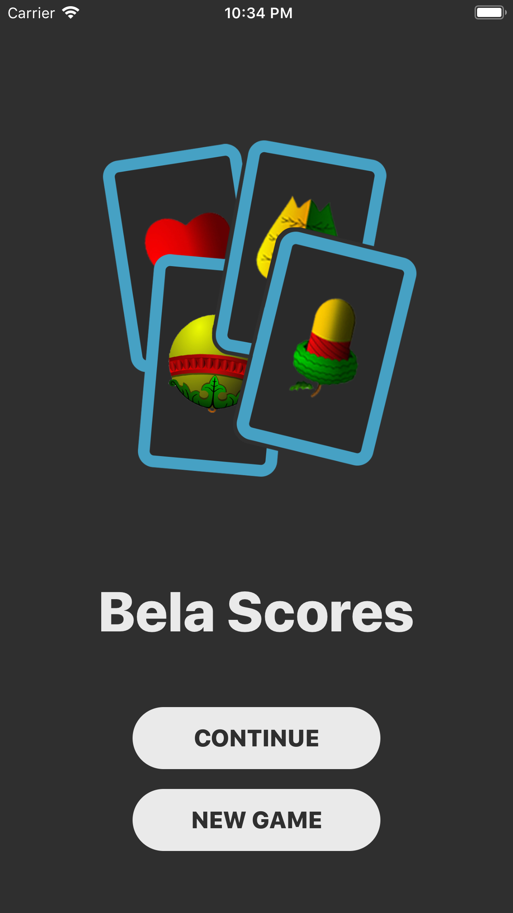
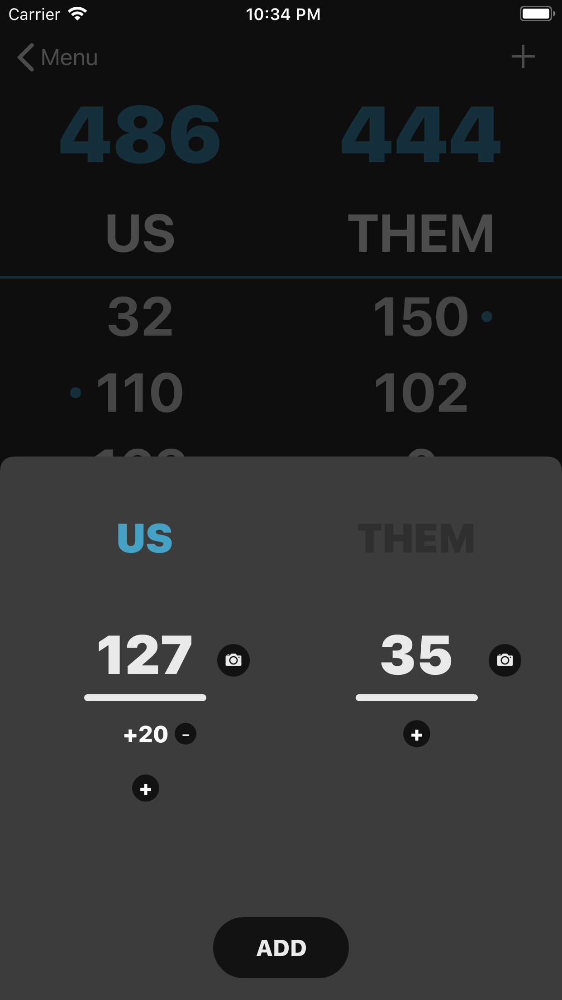
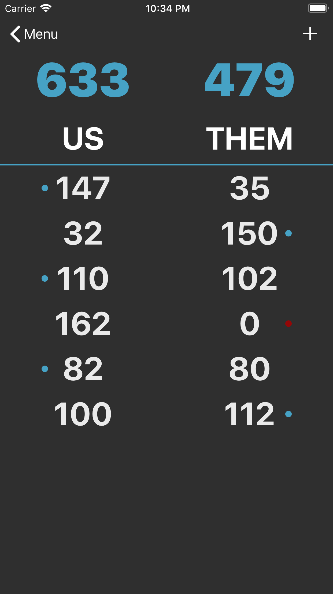

# Bela Scores

[iOS Application](https://apps.apple.com/us/app/bela-scores/id1476583341?ls=1) used for tracking score in Belote playing card game.

Uses [BelaDetector](https://github.com/dCubelic/BelaDetector) for counting won points.

## Screenshots

 
 

## License

This project is licensed under the MIT License - see the [LICENSE.md](LICENSE.md) file for details
